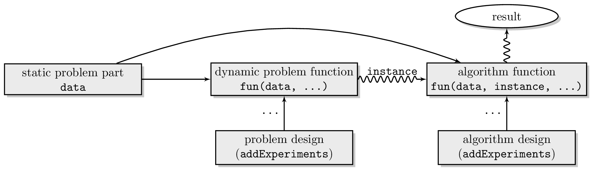
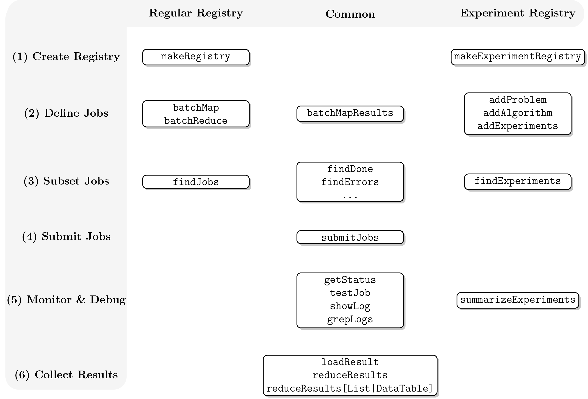

# batchtools

## Setup

### Cluster Functions

The communication with the batch system is managed via so-called cluster
functions. They are created with the constructor
[`makeClusterFunctions()`](https://batchtools.mlr-org.com/reference/makeClusterFunctions.md)
which defines how jobs are submitted on your system. Furthermore, you
may provide functions to list queued/running jobs and to kill jobs.

Usually you do not have to start from scratch but can just use one of
the cluster functions which ship with the package:

- Interactive Cluster Functions (default):
  [`makeClusterFunctionsInteractive()`](https://batchtools.mlr-org.com/reference/makeClusterFunctionsInteractive.md),
  [implementation](https://github.com/mlr-org/batchtools/blob/master/R/clusterFunctionsInteractive.R)
- Multicore Cluster Functions:
  [`makeClusterFunctionsMulticore()`](https://batchtools.mlr-org.com/reference/makeClusterFunctionsMulticore.md),
  [implementation](https://github.com/mlr-org/batchtools/blob/master/R/clusterFunctionsMulticore.R)
- Socket Cluster Functions:
  [`makeClusterFunctionsSocket()`](https://batchtools.mlr-org.com/reference/makeClusterFunctionsSocket.md),
  [implementation](https://github.com/mlr-org/batchtools/blob/master/R/clusterFunctionsSocket.R)
- Makeshift SSH cluster:
  [`makeClusterFunctionsSSH()`](https://batchtools.mlr-org.com/reference/makeClusterFunctionsSSH.md),
  [implementation](https://github.com/mlr-org/batchtools/blob/master/R/clusterFunctionsSSH.R)
- Docker Swarm:
  [`makeClusterFunctionsDocker()`](https://batchtools.mlr-org.com/reference/makeClusterFunctionsDocker.md),
  [implementation](https://github.com/mlr-org/batchtools/blob/master/R/clusterFunctionsDocker.R)
- IBM Spectrum Load Sharing Facility (LSF):
  [`makeClusterFunctionsLSF()`](https://batchtools.mlr-org.com/reference/makeClusterFunctionsLSF.md),
  [implementation](https://github.com/mlr-org/batchtools/blob/master/R/clusterFunctionsLSF.R)
- OpenLava:
  [`makeClusterFunctionsOpenLava()`](https://batchtools.mlr-org.com/reference/makeClusterFunctionsOpenLava.md),
  [implementation](https://github.com/mlr-org/batchtools/blob/master/R/clusterFunctionsOpenLava.R)
- Univa Grid Engine / Oracle Grid Engine (OGE) / Sun Grid Engine (SGE):
  [`makeClusterFunctionsSGE()`](https://batchtools.mlr-org.com/reference/makeClusterFunctionsSGE.md),
  [implementation](https://github.com/mlr-org/batchtools/blob/master/R/clusterFunctionsSGE.R)
- Slurm:
  [`makeClusterFunctionsSlurm()`](https://batchtools.mlr-org.com/reference/makeClusterFunctionsSlurm.md),
  [implementation](https://github.com/mlr-org/batchtools/blob/master/R/clusterFunctionsSlurm.R)
- TORQUE/OpenPBS:
  [`makeClusterFunctionsTORQUE()`](https://batchtools.mlr-org.com/reference/makeClusterFunctionsTORQUE.md),
  [implementation](https://github.com/mlr-org/batchtools/blob/master/R/clusterFunctionsTORQUE.R)

To use the package with the socket cluster functions, you would call the
respective constructor
[`makeClusterFunctionsSocket()`](https://batchtools.mlr-org.com/reference/makeClusterFunctionsSocket.md):

``` r
reg = makeRegistry(NA)
reg$cluster.functions = makeClusterFunctionsSocket(2)
```

To make this selection permanent for this registry, save the
[`?Registry`](https://batchtools.mlr-org.com/reference/makeRegistry.md)
with
[`saveRegistry()`](https://batchtools.mlr-org.com/reference/saveRegistry.md).
To make your cluster function selection permanent for a specific system
across R sessions for all new Registries, you can set up a configuration
file (see below).

If you have trouble debugging your cluster functions, you can enable the
debug mode for extra output. To do so, install the [debugme
package](https://cran.r-project.org/package=debugme) and set the
environment variable `DEBUGME` to `batchtools` before you load the
`batchtools` package:

``` r
Sys.setenv(DEBUGME = "batchtools")
library(batchtools)
```

### Template Files

Many cluster functions require a template file as argument. These
templates are used to communicate with the scheduler and contain
placeholders to evaluate arbitrary R expressions. Internally, the [brew
package](https://cran.r-project.org/package=brew) is used for this
purpose. Some exemplary template files can be found
[here](https://github.com/mlr-org/batchtools/tree/master/inst/templates).
It would be great if you would help expand this collection to cover more
exotic configurations. To do so, open a new pull request.

Note that all variables defined in a
[`?JobCollection`](https://batchtools.mlr-org.com/reference/JobCollection.md)
can be used inside the template. If you need to pass extra variables,
you can set them via the argument `resources` of
[`submitJobs()`](https://batchtools.mlr-org.com/reference/submitJobs.md).

If the flexibility which comes with templating is not sufficient, you
can still construct a custom cluster function implementation yourself
using the provided
[`makeClusterFunctions()`](https://batchtools.mlr-org.com/reference/makeClusterFunctions.md).

### Configuration File

The configuration file can be used to set system specific options. Its
default location depends on the operating system (see
[`makeRegistry()`](https://batchtools.mlr-org.com/reference/makeRegistry.md)),
but for the first time setup you can put one in the current working
directory (as reported by
[`getwd()`](https://rdrr.io/r/base/getwd.html)). In order to set the
cluster function implementation, you would generate a file with the
following content:

``` r
cluster.functions = makeClusterFunctionsInteractive()
```

The configuration file is parsed whenever you create or load a
[`?Registry`](https://batchtools.mlr-org.com/reference/makeRegistry.md).
It is sourced inside of your registry which has the advantage that you
can (a) access all of the parameters which are passed to makeRegistry()
and (b) you can also directly change them. Lets say you always want your
working directory in your home directory and you always want to load the
`checkmate` package on the nodes, you can just append these lines:

``` r
work.dir = "~"
packages = union(packages, "checkmate")
```

See the documentation on
[`?Registry`](https://batchtools.mlr-org.com/reference/makeRegistry.md)
for a more complete list of supported configuration options.

## Migration from `BatchJobs`/`Batchexperiments`

The development of [BatchJobs](https://github.com/tudo-r/BatchJobs/) and
[BatchExperiments](https://github.com/tudo-r/Batchexperiments) is
discontinued because of the following reasons:

- Maintainability: The packages
  [BatchJobs](https://github.com/tudo-r/BatchJobs/) and
  [BatchExperiments](https://github.com/tudo-r/Batchexperiments) are
  tightly connected which makes maintaining difficult. Changes have to
  be synchronized and tested against the current CRAN versions for
  compatibility. Furthermore, BatchExperiments violates CRAN policies by
  calling internal functions of BatchJobs.
- Data base issues: Although we invested weeks to mitigate issues with
  locks of the SQLite data base or file system (staged queries, file
  system timeouts, …), BatchJobs kept working unreliable on some systems
  with high latency or specific file systems. This made BatchJobs
  unusable for many users.

[BatchJobs](https://github.com/tudo-r/BatchJobs/) and
[BatchExperiments](https://github.com/tudo-r/Batchexperiments) will
remain on CRAN or Github, but new features are unlikely to be ported
back.

### Internal Changes

- batchtools does not use SQLite anymore. Instead, all the information
  is stored directly in the registry using
  [data.tables](https://cran.r-project.org/package=data.table) acting as
  an in-memory database. As a side effect, many operations are much
  faster.
- Nodes do not have to access the registry.
  [`submitJobs()`](https://batchtools.mlr-org.com/reference/submitJobs.md)
  stores a temporary object of type
  [`doJobCollection()`](https://batchtools.mlr-org.com/reference/doJobCollection.md)
  on the node. This avoids file system locks because each job accesses
  only one file exclusively.
- `ClusterFunctionsMulticore` now uses the parallel package for
  multicore execution.
- `ClusterFunctionsSSH` can still be used to emulate a scheduler-like
  system which respects the work load on the local machine. Setting the
  hostname to `"localhost"` just strips out `ssh` of the command issued.

### Interface Changes

- batchtools remembers the last created or loaded Registry and sets it
  as default registry. This way, you do not need to pass the registry
  around anymore. If you need to work with multiple registries
  simultaneously on the other hand, you can still do so by explicitly
  passing registries to the functions.
- Most functions now return a
  [data.table](https://cran.r-project.org/package=data.table) which is
  keyed with the `job.id`. This way, return values can be joined
  together easily and efficient (see
  [`?JoinTables`](https://batchtools.mlr-org.com/reference/JoinTables.md))
  for some examples).
- The building blocks of a problem has been renamed from `static` and
  `dynamic` to the more intuitive `data` and `fun`. Thus, algorithm
  function should have the formal arguments `job`, `data` and
  `instance`.
- The function `makeDesign` has been removed. Parameters can be defined
  by just passing a `data.frame` or `data.table` to
  [`addExperiments()`](https://batchtools.mlr-org.com/reference/addExperiments.md).
  For exhaustive designs, use
  [`data.table::CJ()`](https://rdatatable.gitlab.io/data.table/reference/J.html).

### Template changes

- The scheduler should directly execute the command:

&nbsp;

    Rscript -e 'batchtools::doJobCollection(<filename>)'

There is no intermediate R source file like there was in `BatchJobs`. \*
All information stored in the object
[`?JobCollection`](https://batchtools.mlr-org.com/reference/JobCollection.md)
can be accessed while brewing the template. \* Extra variables may be
passed via the argument `resoures` of
[`submitJobs()`](https://batchtools.mlr-org.com/reference/submitJobs.md).

### New features

- Support for Docker Swarm via `?ClusterFunctionsDocker`.
- Jobs can now be tagged and untagged to provide an easy way to group
  them.
- Some resources like the number of CPUs are now optionally passed to
  [parallelMap](https://cran.r-project.org/package=parallelMap). This
  eases nested parallelization, e.g. to use multicore parallelization on
  the slave by just setting a resource on the master. See
  [`submitJobs()`](https://batchtools.mlr-org.com/reference/submitJobs.md)
  for an example.
- [`?ClusterFunctions`](https://batchtools.mlr-org.com/reference/makeClusterFunctions.md)
  are now more flexible in general as they can define hook functions
  which will be called at certain events. `?ClusterFunctionsDocker` is
  an example use case which implements a housekeeping routine. This
  routine is called every time before a job is about to get submitted to
  the scheduler (in the case: the Docker Swarm) via the hook
  `pre.submit` and every time directly after the registry synchronized
  jobs stored on the file system via the hook `post.sync`.

### Porting to `batchtools`

The following table assists in porting to batchtools by mapping
BatchJobs/BatchExperiments functions to their counterparts in
batchtools. The table does not cover functions which are (a) used only
internally in BatchJobs and (b) functions which have not been renamed.

| BatchJobs                |                                                   batchtools                                                   |
|--------------------------|:--------------------------------------------------------------------------------------------------------------:|
| `addRegistryPackages`    |                         Set `reg$packages` or `reg$namespaces`, call saveRegistry()\]                          |
| `addRegistrySourceDirs`  |                                                       \-                                                       |
| `addRegistrySourceFiles` |                                     Set `reg$source`, call saveRegistry()                                      |
| `batchExpandGrid`        |                                 `batchMap(..., args = CJ(x = 1:3, y = 1:10))`                                  |
| `batchMapQuick`          |                      [`btmapply()`](https://batchtools.mlr-org.com/reference/btlapply.md)                      |
| `batchReduceResults`     |                                                       \-                                                       |
| `batchUnexport`          |                   [`batchExport()`](https://batchtools.mlr-org.com/reference/batchExport.md)                   |
| `filterResults`          |                                                       \-                                                       |
| `getJobIds`              |                      [`findJobs()`](https://batchtools.mlr-org.com/reference/findJobs.md)                      |
| `getJobInfo`             |                  [`getJobStatus()`](https://batchtools.mlr-org.com/reference/getJobTable.md)                   |
| `getJob`                 |                    [`makeJob()`](https://batchtools.mlr-org.com/reference/JobExperiment.md)                    |
| `getJobParamDf`          |                   [`getJobPars()`](https://batchtools.mlr-org.com/reference/getJobTable.md)                    |
| `loadResults`            |             [`reduceResultsList()`](https://batchtools.mlr-org.com/reference/reduceResultsList.md)             |
| `reduceResultsDataFrame` |          [`reduceResultsDataTable()`](https://batchtools.mlr-org.com/reference/reduceResultsList.md)           |
| `reduceResultsMatrix`    | [`reduceResultsList()`](https://batchtools.mlr-org.com/reference/reduceResultsList.md) + `do.call(rbind, res)` |
| `reduceResultsVector`    |          [`reduceResultsDataTable()`](https://batchtools.mlr-org.com/reference/reduceResultsList.md)           |
| `setJobFunction`         |                                                       \-                                                       |
| `setJobNames`            |                                                       \-                                                       |
| `showStatus`             |                     [`getStatus()`](https://batchtools.mlr-org.com/reference/getStatus.md)                     |

## Example 1: Approximation of \\\pi\\

To get a first insight into the usage of `batchtools`, we start with an
exemplary Monte Carlo simulation to approximate \\\pi\\. For background
information, see
[Wikipedia](https://en.wikipedia.org/wiki/Monte_Carlo_method).

First, a so-called registry object has to be created, which defines a
directory where all relevant information, files and results of the
computational jobs will be stored. There are two different types of
registry objects: First, a regular
[`?Registry`](https://batchtools.mlr-org.com/reference/makeRegistry.md)
which we will use in this example. Second, an
[`?ExperimentRegistry`](https://batchtools.mlr-org.com/reference/makeExperimentRegistry.md)
which provides an alternative way to define computational jobs and
thereby is tailored for a broad range of large scale computer
experiments. Here, we use a temporary registry which is stored in the
temp directory of the system and gets automatically deleted if you close
the R session.

``` r
reg = makeRegistry(file.dir = NA, seed = 1)
```

For a permanent registry, set the `file.dir` to a valid path. It can
then be reused later, e.g., when you login to the system again, by
calling the function `loadRegistry(file.dir)`.

When a registry object is created or loaded, it is stored for the active
R session as the default. Therefore the argument `reg` will be ignored
in functions calls of this example, assuming the correct registry is set
as default. To get the current default registry,
[`getDefaultRegistry()`](https://batchtools.mlr-org.com/reference/getDefaultRegistry.md)
can be used. To switch to another registry, use
[`setDefaultRegistry()`](https://batchtools.mlr-org.com/reference/getDefaultRegistry.md).

First, we create a function which samples \\n\\ points \\(x_i, y_i)\\
whereas \\x_i\\ and \\y_i\\ are distributed uniformly, i.e. \\x_i, y_i
\sim \mathcal{U}(0,1)\\. Next, the distance to the origin \\(0, 0)\\ is
calculated and the fraction of points in the unit circle (\\d \leq 1\\)
is returned.

``` r
piApprox = function(n) {
  nums = matrix(runif(2 * n), ncol = 2)
  d = sqrt(nums[, 1]^2 + nums[, 2]^2)
  4 * mean(d <= 1)
}
set.seed(42)
piApprox(1000)
```

    ## [1] 3.156

We now parallelize `piApprox()` with `batchtools`: We create 10 jobs,
each doing a MC simulation with \\10^5\\ jobs. We use
[`batchMap()`](https://batchtools.mlr-org.com/reference/batchMap.md) to
define the jobs (note that this does not yet start the calculation):

``` r
batchMap(fun = piApprox, n = rep(1e5, 10))
```

    ## Adding 10 jobs ...

The length of the vector or list defines how many different jobs are
created, while the elements itself are used as arguments for the
function. The function `batchMap(fun, ...)` works analogously to
`Map(f, ...)` of the base package. An overview over the jobs and their
IDs can be retrieved with
[`getJobTable()`](https://batchtools.mlr-org.com/reference/getJobTable.md)
which returns a data.frame with all relevant information:

``` r
names(getJobTable())
```

    ##  [1] "job.id"       "submitted"    "started"      "done"         "error"       
    ##  [6] "mem.used"     "batch.id"     "log.file"     "job.hash"     "job.name"    
    ## [11] "time.queued"  "time.running" "job.pars"     "resources"    "tags"

Note that a unique job ID is assigned to each job. These IDs can be used
to restrict operations to subsets of jobs. To actually start the
calculation, call
[`submitJobs()`](https://batchtools.mlr-org.com/reference/submitJobs.md).
The registry and the selected job IDs can be taken as arguments as well
as an arbitrary list of resource requirements, which are to be handled
by the cluster back end.

``` r
submitJobs(resources = list(walltime = 3600, memory = 1024))
```

    ## Submitting 10 jobs in 10 chunks using cluster functions 'Interactive' ...

In this example, a cap for the execution time (so-called walltime) and
for the maximum memory requirements are set. The progress of the
submitted jobs can be checked with
[`getStatus()`](https://batchtools.mlr-org.com/reference/getStatus.md).

``` r
getStatus()
```

    ## Status for 10 jobs at 2025-11-26 10:23:49:
    ##   Submitted    : 10 (100.0%)
    ##   -- Queued    :  0 (  0.0%)
    ##   -- Started   : 10 (100.0%)
    ##   ---- Running :  0 (  0.0%)
    ##   ---- Done    : 10 (100.0%)
    ##   ---- Error   :  0 (  0.0%)
    ##   ---- Expired :  0 (  0.0%)

The resulting output includes the number of jobs in the registry, how
many have been submitted, have started to execute on the batch system,
are currently running, have successfully completed, and have terminated
due to an R exception. After jobs have successfully terminated, we can
load their results on the master. This can be done in a simple fashion
by using either
[`loadResult()`](https://batchtools.mlr-org.com/reference/loadResult.md),
which returns a single result exactly in the form it was calculated
during mapping, or by using
[`reduceResults()`](https://batchtools.mlr-org.com/reference/reduceResults.md),
which is a version of [`Reduce()`](https://rdrr.io/r/base/funprog.html)
from the base package for registry objects.

``` r
waitForJobs()
```

    ## [1] TRUE

``` r
mean(sapply(1:10, loadResult))
```

    ## [1] 3.140652

``` r
reduceResults(function(x, y) x + y) / 10
```

    ## [1] 3.140652

If you are absolutely sure that your function works, you can take a
shortcut and use *batchtools* in an `lapply` fashion using
[`btlapply()`](https://batchtools.mlr-org.com/reference/btlapply.md).
This function creates a temporary registry (but you may also pass one
yourself), calls
[`batchMap()`](https://batchtools.mlr-org.com/reference/batchMap.md),
wait for the jobs to terminate with
[`waitForJobs()`](https://batchtools.mlr-org.com/reference/waitForJobs.md)
and then uses
[`reduceResultsList()`](https://batchtools.mlr-org.com/reference/reduceResultsList.md)
to return the results.

``` r
res = btlapply(rep(1e5, 10), piApprox)
mean(unlist(res))
```

    ## [1] 3.14124

## Example 2: Machine Learning

We stick to a rather simple, but not unrealistic example to explain some
further functionalities: Applying two classification learners to the
famous iris data set (Anderson 1935), vary a few hyperparameters and
evaluate the effect on the classification performance.

First, we create a registry, the central meta-data object which records
technical details and the setup of the experiments. We use an
[`?ExperimentRegistry`](https://batchtools.mlr-org.com/reference/makeExperimentRegistry.md)
where the job definition is split into creating problems and algorithms.
See the paper on [BatchJobs and
BatchExperiments](https://www.jstatsoft.org/article/view/v064i11) for a
detailed explanation. Again, we use a temporary registry and make it the
default registry.

``` r
library(batchtools)
reg = makeExperimentRegistry(file.dir = NA, seed = 1)
```

### Problems and Algorithms

By adding a problem to the registry, we can define the data on which
certain computational jobs shall work. This can be a matrix, data frame
or array that always stays the same for all subsequent experiments. But
it can also be of a more dynamic nature, e.g., subsamples of a dataset
or random numbers drawn from a probability distribution . Therefore the
function
[`addProblem()`](https://batchtools.mlr-org.com/reference/addProblem.md)
accepts static parts in its `data` argument, which is passed to the
argument `fun` which generates a (possibly stochastic) problem instance.
For `data`, any R object can be used. If only `data` is given, the
generated instance is `data`. The argument `fun` has to be a function
with the arguments `data` and `job` (and optionally other arbitrary
parameters). The argument `job` is an object of type
[`?Job`](https://batchtools.mlr-org.com/reference/JobExperiment.md)
which holds additional information about the job.

We want to split the iris data set into a training set and test set. In
this example we use use subsampling which just randomly takes a fraction
of the observations as training set. We define a problem function which
returns the indices of the respective training and test set for a split
with `100 * ratio`% of the observations being in the test set:

``` r
subsample = function(data, job, ratio, ...) {
  n = nrow(data)
  train = sample(n, floor(n * ratio))
  test = setdiff(seq_len(n), train)
  list(test = test, train = train)
}
```

[`addProblem()`](https://batchtools.mlr-org.com/reference/addProblem.md)
files the problem to the file system and the problem gets recorded in
the registry.

``` r
data("iris", package = "datasets")
addProblem(name = "iris", data = iris, fun = subsample, seed = 42)
```

    ## Adding problem 'iris'

The function call will be evaluated at a later stage on the workers. In
this process, the `data` part will be loaded and passed to the function.
Note that we set a problem seed to synchronize the experiments in the
sense that the same resampled training and test sets are used for the
algorithm comparison in each distinct replication.

The algorithms for the jobs are added to the registry in a similar
manner. When using
[`addAlgorithm()`](https://batchtools.mlr-org.com/reference/addAlgorithm.md),
an identifier as well as the algorithm to apply to are required
arguments. The algorithm must be given as a function with arguments
`job`, `data` and `instance`. Further arbitrary arguments (e.g.,
hyperparameters or strategy parameters) may be defined analogously as
for the function in `addProblem`. The objects passed to the function via
`job` and `data` are here the same as above, while via `instance` the
return value of the evaluated problem function is passed. The algorithm
can return any R object which will automatically be stored on the file
system for later retrieval. Firstly, we create an algorithm which
applies a support vector machine:

``` r
svm.wrapper = function(data, job, instance, ...) {
  library("e1071")
  mod = svm(Species ~ ., data = data[instance$train, ], ...)
  pred = predict(mod, newdata = data[instance$test, ], type = "class")
  table(data$Species[instance$test], pred)
}
addAlgorithm(name = "svm", fun = svm.wrapper)
```

    ## Adding algorithm 'svm'

Secondly, a random forest of classification trees:

``` r
forest.wrapper = function(data, job, instance, ...) {
  library("ranger")
  mod = ranger(Species ~ ., data = data[instance$train, ], write.forest = TRUE)
  pred = predict(mod, data = data[instance$test, ])
  table(data$Species[instance$test], pred$predictions)
}
addAlgorithm(name = "forest", fun = forest.wrapper)
```

    ## Adding algorithm 'forest'

Both algorithms return a confusion matrix for the predictions on the
test set, which will later be used to calculate the misclassification
rate.

Note that using the `...` argument in the wrapper definitions allows us
to circumvent naming specific design parameters for now. This is an
advantage if we later want to extend the set of algorithm parameters in
the experiment. The algorithms get recorded in the registry and the
corresponding functions are stored on the file system.

Defined problems and algorithms can be queried with:

``` r
reg$problems
```

    ## [1] "iris"

``` r
reg$algorithms
```

    ## [1] "svm"    "forest"

The flow to define experiments is summarized in the following figure:



### Creating jobs

[`addExperiments()`](https://batchtools.mlr-org.com/reference/addExperiments.md)
is used to parametrize the jobs and thereby define computational jobs.
To do so, you have to pass named lists of parameters to
[`addExperiments()`](https://batchtools.mlr-org.com/reference/addExperiments.md).
The elements of the respective list (one for problems and one for
algorithms) must be named after the problem or algorithm they refer to.
The data frames contain parameter constellations for the problem or
algorithm function where columns must have the same names as the target
arguments. When the problem design and the algorithm design are combined
in
[`addExperiments()`](https://batchtools.mlr-org.com/reference/addExperiments.md),
each combination of the parameter sets of the two designs defines a
distinct job. How often each of these jobs should be computed can be
determined with the argument `repls`.

``` r
# problem design: try two values for the ratio parameter
pdes = list(iris = data.table(ratio = c(0.67, 0.9)))

# algorithm design: try combinations of kernel and epsilon exhaustively,
# try different number of trees for the forest
ades = list(
  svm = CJ(kernel = c("linear", "polynomial", "radial"), epsilon = c(0.01, 0.1)),
  forest = data.table(ntree = c(100, 500, 1000))
)

addExperiments(pdes, ades, repls = 5)
```

    ## Adding 60 experiments ('iris'[2] x 'svm'[6] x repls[5]) ...

    ## Adding 30 experiments ('iris'[2] x 'forest'[3] x repls[5]) ...

The jobs are now available in the registry with an individual job ID for
each. The function
[`summarizeExperiments()`](https://batchtools.mlr-org.com/reference/summarizeExperiments.md)
returns a table which gives a quick overview over all defined
experiments.

``` r
summarizeExperiments()
```

    ##    problem algorithm .count
    ##     <char>    <char>  <int>
    ## 1:    iris       svm     60
    ## 2:    iris    forest     30

``` r
summarizeExperiments(by = c("problem", "algorithm", "ratio"))
```

    ##    problem algorithm ratio .count
    ##     <char>    <char> <num>  <int>
    ## 1:    iris       svm  0.67     30
    ## 2:    iris       svm  0.90     30
    ## 3:    iris    forest  0.67     15
    ## 4:    iris    forest  0.90     15

### Before Submitting

Before submitting all jobs to the batch system, we encourage you to test
each algorithm individually. Or sometimes you want to submit only a
subset of experiments because the jobs vastly differ in runtime. Another
reoccurring task is the collection of results for only a subset of
experiments. For all these use cases,
[`findExperiments()`](https://batchtools.mlr-org.com/reference/findJobs.md)
can be employed to conveniently select a particular subset of jobs. It
returns the IDs of all experiments that match the given criteria. Your
selection can depend on substring matches of problem or algorithm IDs
using `prob.name` or `algo.name`, respectively. You can also pass R
expressions, which will be evaluated in your problem parameter setting
(`prob.pars`) or algorithm parameter setting (`algo.pars`). The
expression is then expected to evaluate to a Boolean value. Furthermore,
you can restrict the experiments to specific replication numbers.

To illustrate
[`findExperiments()`](https://batchtools.mlr-org.com/reference/findJobs.md),
we will select two experiments, one with a support vector machine and
the other with a random forest and the parameter `ntree = 1000`. The
selected experiment IDs are then passed to testJob.

``` r
id1 = head(findExperiments(algo.name = "svm"), 1)
print(id1)
```

    ## Key: <job.id>
    ##    job.id
    ##     <int>
    ## 1:      1

``` r
id2 = head(findExperiments(algo.name = "forest", algo.pars = (ntree == 1000)), 1)
print(id2)
```

    ## Key: <job.id>
    ##    job.id
    ##     <int>
    ## 1:     71

``` r
testJob(id = id1)
```

    ## ### [bt]: Generating problem instance for problem 'iris' ...
    ## ### [bt]: Applying algorithm 'svm' on problem 'iris' for job 1 (seed = 2) ...

    ##             pred
    ##              setosa versicolor virginica
    ##   setosa         13          0         0
    ##   versicolor      0         17         0
    ##   virginica       0          1        19

``` r
testJob(id = id2)
```

    ## ### [bt]: Generating problem instance for problem 'iris' ...
    ## ### [bt]: Applying algorithm 'forest' on problem 'iris' for job 71 (seed = 72) ...

    ##             
    ##              setosa versicolor virginica
    ##   setosa         13          0         0
    ##   versicolor      0         16         1
    ##   virginica       0          1        19

If something goes wrong, `batchtools` comes with a bunch of useful
debugging utilities (see separate vignette on error handling). If
everything turns out fine, we can proceed with the calculation.

### Submitting and Collecting Results

To submit the jobs, we call
[`submitJobs()`](https://batchtools.mlr-org.com/reference/submitJobs.md)
and wait for all jobs to terminate using
[`waitForJobs()`](https://batchtools.mlr-org.com/reference/waitForJobs.md).

``` r
submitJobs()
```

    ## Submitting 90 jobs in 90 chunks using cluster functions 'Interactive' ...

``` r
waitForJobs()
```

    ## [1] TRUE

After jobs are finished, the results can be collected with
[`reduceResultsDataTable()`](https://batchtools.mlr-org.com/reference/reduceResultsList.md)
where we directly extract the mean misclassification error:

``` r
reduce = function(res) list(mce = (sum(res) - sum(diag(res))) / sum(res))
results = unwrap(reduceResultsDataTable(fun = reduce))
head(results)
```

    ## Key: <job.id>
    ##    job.id   mce
    ##     <int> <num>
    ## 1:      1  0.02
    ## 2:      2  0.00
    ## 3:      3  0.04
    ## 4:      4  0.06
    ## 5:      5  0.02
    ## 6:      6  0.02

Next, we merge the results table with the table of job parameters using
one of the join helpers (see
[`?JoinTables`](https://batchtools.mlr-org.com/reference/JoinTables.md))
provided by `batchtools` (here, we use an inner join):

``` r
pars = unwrap(getJobPars())
tab = ijoin(pars, results)
head(tab)
```

    ## Key: <job.id>
    ##    job.id problem algorithm ratio kernel epsilon ntree   mce
    ##     <int>  <char>    <char> <num> <char>   <num> <num> <num>
    ## 1:      1    iris       svm  0.67 linear    0.01    NA  0.02
    ## 2:      2    iris       svm  0.67 linear    0.01    NA  0.00
    ## 3:      3    iris       svm  0.67 linear    0.01    NA  0.04
    ## 4:      4    iris       svm  0.67 linear    0.01    NA  0.06
    ## 5:      5    iris       svm  0.67 linear    0.01    NA  0.02
    ## 6:      6    iris       svm  0.67 linear    0.10    NA  0.02

We now aggregate the results group-wise. You can use
[`data.table`](https://cran.r-project.org/package=data.table),
`base::aggregate()`, or the
[`dplyr`](https://cran.r-project.org/package=dplyr) package for this
purpose. Here, we use
[`data.table`](https://cran.r-project.org/package=data.table) to subset
the table to jobs where the ratio is `0.67` and group by algorithm the
algorithm hyperparameters:

``` r
tab[ratio == 0.67, list(mmce = mean(mce)),
  by = c("algorithm", "kernel", "epsilon", "ntree")]
```

    ##    algorithm     kernel epsilon ntree  mmce
    ##       <char>     <char>   <num> <num> <num>
    ## 1:       svm     linear    0.01    NA 0.028
    ## 2:       svm     linear    0.10    NA 0.028
    ## 3:       svm polynomial    0.01    NA 0.096
    ## 4:       svm polynomial    0.10    NA 0.096
    ## 5:       svm     radial    0.01    NA 0.044
    ## 6:       svm     radial    0.10    NA 0.044
    ## 7:    forest       <NA>      NA   100 0.044
    ## 8:    forest       <NA>      NA   500 0.048
    ## 9:    forest       <NA>      NA  1000 0.044

## Example: Error Handling

In any large scale experiment many things can and will go wrong. The
cluster might have an outage, jobs may run into resource limits or
crash, subtle bugs in your code could be triggered or any other error
condition might arise. In these situations it is important to quickly
determine what went wrong and to recompute only the minimal number of
required jobs.

Therefore, before you submit anything you should use
[`testJob()`](https://batchtools.mlr-org.com/reference/testJob.md) to
catch errors that are easy to spot because they are raised in many or
all jobs. If `external` is set, this function runs the job without side
effects in an independent R process on your local machine via `Rscript`
similar as on the slave, redirects the output of the process to your R
console, loads the job result and returns it. If you do not set
`external`, the job is executed is in the currently running R session,
with the drawback that you might be unable to catch missing variable
declarations or missing package dependencies.

By way of illustration here is a small example. First, we create a
temporary registry.

``` r
library(batchtools)
reg = makeRegistry(file.dir = NA, seed = 1)
```

Ten jobs are created, one will trow a warning and two of them will raise
an exception.

``` r
flakeyFunction <- function(value) {
  if (value == 5) warning("Just a simple warning")
  if (value %in% c(2, 9)) stop("Ooops.")
  value^2
}
batchMap(flakeyFunction, 1:10)
```

    ## Adding 10 jobs ...

Now that the jobs are defined, we can test jobs independently:

``` r
testJob(id = 1)
```

    ## ### [bt]: Setting seed to 2 ...

    ## [1] 1

In this case, testing the job with ID = 1 provides the appropriate
result but testing the job with ID = 2 leads to an error:

``` r
as.character(try(testJob(id = 2)))
```

    ## ### [bt]: Setting seed to 3 ...
    ## Error in (function (value)  : Ooops.

    ## [1] "Error in (function (value)  : Ooops.\n"

We ignore the error here, and just assume everything looks fine and
submit all jobs.

``` r
submitJobs()
```

    ## Submitting 10 jobs in 10 chunks using cluster functions 'Interactive' ...

    ## Error in (function (value)  : Ooops.

    ## Warning in (function (value) : Just a simple warning

    ## Error in (function (value)  : Ooops.

``` r
waitForJobs()
```

    ## [1] FALSE

After you have submitted jobs and suspect that something is going wrong,
the first thing to do is to run
[`getStatus()`](https://batchtools.mlr-org.com/reference/getStatus.md)
to display a summary of the current state of the system.

``` r
getStatus()
```

    ## Status for 10 jobs at 2025-11-26 10:23:53:
    ##   Submitted    : 10 (100.0%)
    ##   -- Queued    :  0 (  0.0%)
    ##   -- Started   : 10 (100.0%)
    ##   ---- Running :  0 (  0.0%)
    ##   ---- Done    :  8 ( 80.0%)
    ##   ---- Error   :  2 ( 20.0%)
    ##   ---- Expired :  0 (  0.0%)

The status message shows that two of the jobs could not be executed
successfully. To get the IDs of all jobs that failed due to an error we
can use
[`findErrors()`](https://batchtools.mlr-org.com/reference/findJobs.md)
and to retrieve the actual error message, we can use
[`getErrorMessages()`](https://batchtools.mlr-org.com/reference/getErrorMessages.md).

``` r
findErrors()
```

    ## Key: <job.id>
    ##    job.id
    ##     <int>
    ## 1:      2
    ## 2:      9

``` r
getErrorMessages()
```

    ## Key: <job.id>
    ##    job.id terminated  error                              message
    ##     <int>     <lgcl> <lgcl>                               <char>
    ## 1:      2       TRUE   TRUE Error in (function (value)  : Ooops.
    ## 2:      9       TRUE   TRUE Error in (function (value)  : Ooops.

If we want to peek into the R log file of a job to see more context for
the error we can use
[`showLog()`](https://batchtools.mlr-org.com/reference/showLog.md) which
opens a pager or use
[`getLog()`](https://batchtools.mlr-org.com/reference/showLog.md) to get
the log as character vector:

``` r
tail(getLog(id = 9))
```

    ## [1] "### [bt]: Memory measurement disabled"                           
    ## [2] "### [bt]: Starting job [batchtools job.id=9]"                    
    ## [3] "### [bt]: Setting seed to 10 ..."                                
    ## [4] ""                                                                
    ## [5] "### [bt]: Job terminated with an exception [batchtools job.id=9]"
    ## [6] "### [bt]: Calculation finished!"

You can also grep for messages (output suppressed in this vignette for
technical reasons):

``` r
grepLogs(pattern = "simple", ignore.case = TRUE)
```

## Workflow

### On the Local System

1.  Create a Registry with
    [`makeRegistry()`](https://batchtools.mlr-org.com/reference/makeRegistry.md)
    /
    [`makeExperimentRegistry()`](https://batchtools.mlr-org.com/reference/makeExperimentRegistry.md)
    or load an existing from the file system with
    [`loadRegistry()`](https://batchtools.mlr-org.com/reference/loadRegistry.md).
2.  Define computational jobs with
    [`batchMap()`](https://batchtools.mlr-org.com/reference/batchMap.md)
    /
    [`batchReduce()`](https://batchtools.mlr-org.com/reference/batchReduce.md)
    if you used
    [`makeRegistry()`](https://batchtools.mlr-org.com/reference/makeRegistry.md)
    or define an experiment with
    [`addAlgorithm()`](https://batchtools.mlr-org.com/reference/addAlgorithm.md),
    [`addProblem()`](https://batchtools.mlr-org.com/reference/addProblem.md)
    and
    [`addExperiments()`](https://batchtools.mlr-org.com/reference/addExperiments.md)
    if you started with
    [`makeExperimentRegistry()`](https://batchtools.mlr-org.com/reference/makeExperimentRegistry.md).
    It is advised to test some jobs with
    [`testJob()`](https://batchtools.mlr-org.com/reference/testJob.md)
    in the interactive session and with `testJob(external = TRUE)` in a
    separate R process. Note that you can add additional jobs if you are
    using an
    [`?ExperimentRegistry`](https://batchtools.mlr-org.com/reference/makeExperimentRegistry.md).
3.  If required, query the data base for job ids depending on their
    status, parameters or tags (see
    [`findJobs()`](https://batchtools.mlr-org.com/reference/findJobs.md)).
    The returned tables can easily be combined in a set-like fashion
    with data base verbs: union
    ([`ojoin()`](https://batchtools.mlr-org.com/reference/JoinTables.md)
    for outer join, intersect
    [`ijoin()`](https://batchtools.mlr-org.com/reference/JoinTables.md)
    for inner join, difference
    [`ajoin()`](https://batchtools.mlr-org.com/reference/JoinTables.md)
    for anti join).
4.  Submit jobs with
    [`submitJobs()`](https://batchtools.mlr-org.com/reference/submitJobs.md).
    You can specify job resources here. If you have thousands of fast
    terminating jobs, you want to
    [`chunk()`](https://batchtools.mlr-org.com/reference/chunk.md) them
    first. If some jobs already terminated, you can estimate the
    runtimes with
    [`estimateRuntimes()`](https://batchtools.mlr-org.com/reference/estimateRuntimes.md)
    and chunk jobs into heterogeneous groups with
    [`lpt()`](https://batchtools.mlr-org.com/reference/chunk.md) and
    [`binpack()`](https://batchtools.mlr-org.com/reference/chunk.md).
5.  Monitor jobs.
    [`getStatus()`](https://batchtools.mlr-org.com/reference/getStatus.md)
    gives a summarizing overview. Use
    [`showLog()`](https://batchtools.mlr-org.com/reference/showLog.md)
    and
    [`grepLogs()`](https://batchtools.mlr-org.com/reference/grepLogs.md)
    to investigate log file. Run jobs in the currently running session
    with
    [`testJob()`](https://batchtools.mlr-org.com/reference/testJob.md)
    to get a [`traceback()`](https://rdrr.io/r/base/traceback.html).
6.  Collect (partial) results.
    [`loadResult()`](https://batchtools.mlr-org.com/reference/loadResult.md)
    retrieves a single result from the file system.
    [`reduceResults()`](https://batchtools.mlr-org.com/reference/reduceResults.md)
    mimics [`Reduce()`](https://rdrr.io/r/base/funprog.html) and allows
    to apply a function to many files in an iterative fashion.
    [`reduceResultsList()`](https://batchtools.mlr-org.com/reference/reduceResultsList.md)
    and
    [`reduceResultsDataTable()`](https://batchtools.mlr-org.com/reference/reduceResultsList.md)
    collect results into a `list` or `data.table`, respectively.



### On Multiple Systems

Most users develop and prototype their experiments on a desktop box in
their preferred IDE and later deploy to a large computing cluster. This
can be done by prototyping locally
([`testJob()`](https://batchtools.mlr-org.com/reference/testJob.md)) or
submit subsets via
[`submitJobs()`](https://batchtools.mlr-org.com/reference/submitJobs.md).
To deploy to the cluster, just copy the file directory (as reported by
`reg$file.dir`) to the remote system. Next, log in on the cluster
(typically via `ssh`), `cd` to the copied directory and call
`loadRegistry("<file.dir.on.remote">, "<work.dir.on.remote>", writeable = TRUE)`.
This function will (a) source the local configuration file so that you
can talk to the cluster (verify by checking the output of
`reg$cluster.functions`) and (b) adjust the paths to the new system if
argument `update.paths` is set. After loading the Registry, it is
advised to test some jobs again with
[`testJob()`](https://batchtools.mlr-org.com/reference/testJob.md)
before submitting all of them with `submitJobs(resources = list())`
(remember you now need to set resources!). After some jobs are finished,
the `file.dir` can be copied back (do not merge with the previous
directory!) and loaded again with
[`loadRegistry()`](https://batchtools.mlr-org.com/reference/loadRegistry.md).

This approach is totally viable as long as some general rules are
followed:

1.  Make sure you have all packages installed. Package versions can be
    synchronized across machines with, e.g.,
    [`checkpoint`](https://cran.r-project.org/package=checkpoint) or
    [`packrat`](https://cran.r-project.org/package=packrat).
2.  Test jobs on the remote system prior to submit to ensure that paths
    are resolved correctly.
3.  Make sure you have set the cluster functions in a configuration
    file, and stick to one backend as long as jobs are running.
4.  The status can only be monitored on the remote system (for obvious
    reasons).
5.  Partial results can be inspected both on the remote system and on
    the local system. For the latter, you need to copy over the
    **complete** `file.dir` first. Overwriting/merging directories is
    not advised as this may lead to inconsistencies if you added or
    removed experiments on the remote. If you have to merge, use `rsync`
    with option `--delete`. Load the registry locally with
    [`loadRegistry()`](https://batchtools.mlr-org.com/reference/loadRegistry.md)
    and collect results. Do not copy back and forth.
6.  Avoid accessing the `file.dir` with multiple sessions
    simultaneously. This includes accessing the registry via a mount!
    Simultaneous access may lead to inconsistencies and missing results.
